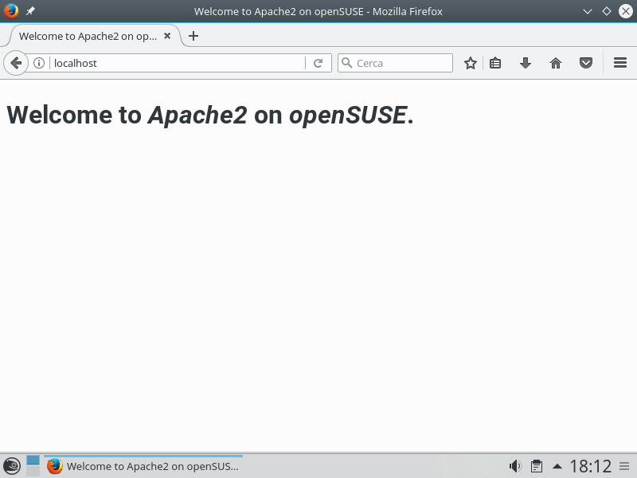
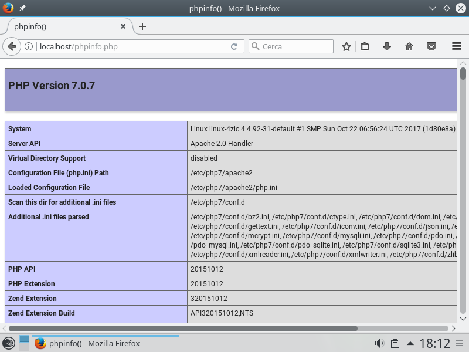
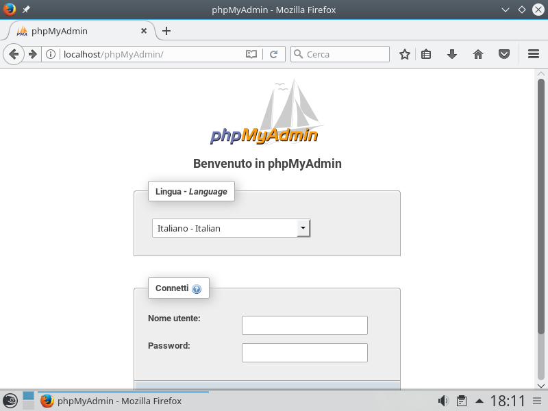

Ho di recente iniziato a sperimentare una nuova (per me) distribuzione Linux: [openSUSE 42.3 Leap](https://it.opensuse.org/). E' basata su *RedHat*, quindi pacchetti .rpm e non .deb e soprattutto un certo orientamento all'area *business*. Me l'ha consigliata un professionista di Linux e devo dire che il feeling è quello di un sistema più "rifinito" di Kubuntu e Xubuntu. Il centro di controllo **YaST** consente di fare graficamente molte impostazioni che su Ubuntu sono riservate alla linea di comando (che io amo moltissimo, ma non essendo un guru mi lascia spesso in *panne* perché non ricordo a memoria i comandi che mi servono).

Comunque in questo articolo userò in larga parte comandi da console, che trovo molto più veloci per eseguire operazioni di installazione e prima configurazione.

Una delle prime cose che ho avuto necessità di fare è configurare un server web per i miei test e quindi... ecco la mia prima guida di openSUSE.

Che poi è in larga parte una traduzione di [questo articolo](https://en.opensuse.org/SDB:LAMP_setup).

**NOTA BENE:** Tutti i comandi di questa guida sono pensati per fare copia e incolla in una shell (io uso Putty) solitamente, ma riflettete un attimo prima di dare conferma!

# Apache2

Apriamo *Konsole* o la nostra shell preferita e cominciamo con installare Apache2:
```
sudo zypper install apache2
```
Per avviare Apache2 digitiamo:
```
sudo systemctl start apache2
```
Se, per qualunque motivo, dobbiamo riavviarlo lo possiamo fare con il comando:
```
sudo systemctl restart apache2
```
E per farlo partire automaticamente all'avvio, **cosa altamente consigliata**, digitiamo una volta sola il comando:
```
sudo systemctl enable apache2
```
Ora creiamo un file di test per controllare che tutto funzioni:
```
sudo sh -c 'cat > /srv/www/htdocs/index.html <<EOF
<!DOCTYPE html PUBLIC "-//W3C//DTD HTML 4.01//EN" "http://www.w3.org/TR/html4/strict.dtd">
<html>

<head>
    <meta content="text/html; charset=ISO-8859-1" http-equiv="content-type">
    <title>Welcome to Apache2 on openSUSE</title>
</head>

<body>
    <h1>Welcome to <i>Apache2</i> on <i>openSUSE</i>.</h1>
</body>

</html>
EOF'
```

E verifichiamo andando con il nostro *browser* preferito all'indirizzo [http://localhost/](http://localhost/).

Il server è pronto per l'utilizzo come test, ma non aperto "al mondo": se vogliamo renderlo visibile occorre aprire il firewall per il servizio *http*. Ci sono molti modi per farlo, la il più veloce è da YaST | Firewall.



# PHP7

Ora occupiamoci di PHP.
```
sudo zypper install php7 php7-mysql apache2-mod_php7
```
Abilitamo il modulo con il comando:
```
sudo a2enmod php7
```
E riavviamo il server:
```
sudo systemctl restart apache2
```
Anche in questo caso creiamo un piccolo file di test:
```
sudo sh -c 'cat > /srv/www/htdocs/phpinfo.php <<EOF
<?php phpinfo(); ?>
EOF'
```
Ora, sempre con il browser che preferiamo, colleghiamoci a [http://localhost/phpinfo.php](http://localhost/phpinfo.php).



# MariaDB (MySQL)


*openSUSE* usa un pacchetto alternativo a *MySQL* di nome **MariaDB**, più completo, che comunque viene chiamato dal sistema *mysql* (e così lo chiameremo anche noi).
Nelle ultime release il pacchetto base è installato per *default*, ma c'è da installare un pacchetto di utilità aggiuntive per l'amministrazione.

Quindi procediamo:
```
sudo zypper install mariadb mariadb-tools
```
Avviamo il server:
```
sudo systemctl start mysql
```
E assicuriamoci che sia in avvio automatico:
```
sudo systemctl enable mysql
```
Anche in questo caso, se per qualunque motivo fosse necessario un riavvio del servizio, basterà digitare:
```
sudo systemctl restart mysql
```
**Messa in sicurezza**
Prima di utilizzare *mysql* in una ambiente di produzione sono necessarie alcune modifiche per la sicurezza, che fortunatamente in *openSUSE* sono raggruppate da uno script.
Lo andremo ad eseguire e confermeremo con **y** (*yes*) ***TUTTE LE RICHIESTE***.
```
sudo mysql_secure_installation
```
Verrà anche richiesto di inserire una password di **root**: è ovviamente indispensabile appuntarsela per usi futuri.

Ecco la lista delle richieste, per confronto:

```bash
NOTE: RUNNING ALL PARTS OF THIS SCRIPT IS RECOMMENDED FOR ALL MariaDB
      SERVERS IN PRODUCTION USE!  PLEASE READ EACH STEP CAREFULLY!

In order to log into MariaDB to secure it, we'll need the current
password for the root user.  If you've just installed MariaDB, and
you haven't set the root password yet, the password will be blank,
so you should just press enter here.

Enter current password for root (enter for none):
OK, successfully used password, moving on...

Setting the root password ensures that nobody can log into the MariaDB
root user without the proper authorisation.

Set root password? [Y/n] y
New password:
Re-enter new password:
Password updated successfully!
Reloading privilege tables..
 ... Success!


By default, a MariaDB installation has an anonymous user, allowing anyone
to log into MariaDB without having to have a user account created for
them.  This is intended only for testing, and to make the installation
go a bit smoother.  You should remove them before moving into a
production environment.

Remove anonymous users? [Y/n] y
 ... Success!

Normally, root should only be allowed to connect from 'localhost'.  This
ensures that someone cannot guess at the root password from the network.

Disallow root login remotely? [Y/n] y
 ... Success!

By default, MariaDB comes with a database named 'test' that anyone can
access.  This is also intended only for testing, and should be removed
before moving into a production environment.

Remove test database and access to it? [Y/n] y
 - Dropping test database...
 ... Success!
 - Removing privileges on test database...
 ... Success!

Reloading the privilege tables will ensure that all changes made so far
will take effect immediately.

Reload privilege tables now? [Y/n] y
 ... Success!

Cleaning up...

All done!  If you've completed all of the above steps, your MariaDB
installation should now be secure.

Thanks for using MariaDB!
```

# phpMyAdmin

**phpMyAdmin** (a volte abbreviato in *pma*) è uno strumento che consente di amministrare il database tramite una interfaccia *web*.

**ATTENZIONE!** in tutti i comandi successivi la grafìa corretta è "phpMyAdmin" che in *openSUSE* è **CASE SENSITIVE**: se lo scriviamo minuscolo, otterremo messaggi di errore.
```
sudo zypper install phpMyAdmin
```
Nel mio caso è stato necessario abilitare una delle estensione che erano state installate automaticamente:
```
sudo a2enmod php7-mbscript
```
e riavviare il server *web*:
```
sudo systemctl restart apache2
```
Ora per accedere all'interfaccia colleghiamoci, sempre con il browser preferito, all'indirizzo [http://localhost/phpMyAdmin/](http://localhost/phpMyAdmin/) da locale oppure a **http://*indirizzo_ip*/phpMyAdmin/** da remoto.


Ecco pronto il nostro server **LAMP** (anzi *LAMPpma*!)